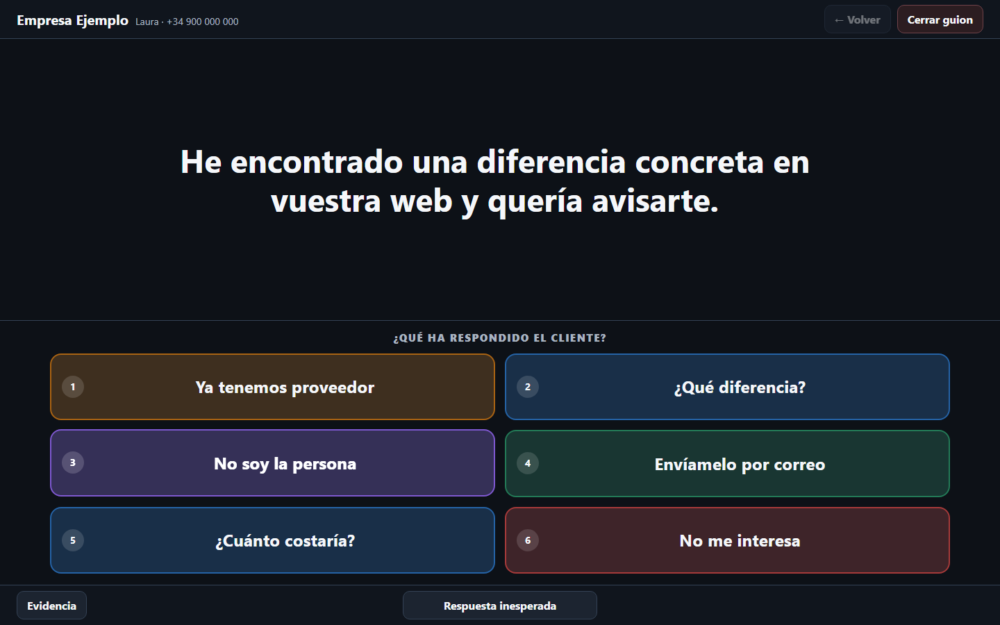

# Call Tree Player

Reproductor gratuito de guiones de llamada ramificados. Carga un `.call.json` y avanza por el guion según lo que responda la otra persona.

> **[Abrir Call Tree Player en el navegador](https://zautomation-real.github.io/call-tree-player/)**  
> No requiere registro, instalación ni subida de archivos.



## Empezar en menos de un minuto

1. Abre **[la aplicación web](https://zautomation-real.github.io/call-tree-player/)**.
2. Pulsa **Seleccionar archivo** o arrastra un archivo `.call.json` sobre la zona de carga.
3. Si todavía no tienes uno, descarga el ejemplo [`minimal.call.json`](fixtures/valid/minimal.call.json) mediante **Download raw file** en GitHub.
4. Revisa el resumen y pulsa **Iniciar llamada**.
5. Durante la llamada, elige la respuesta que más se aproxime a lo que diga el cliente. El reproductor mostrará automáticamente el siguiente fragmento del guion.

El guion se lee dentro de tu navegador. **No se envía a este repositorio ni a ningún servidor del proyecto.** La sesión se conserva únicamente en el almacenamiento local del dispositivo para poder recuperarla si recargas la página.

## Dos formas de usarlo

| Modalidad | Para quién | Qué hay que hacer |
| --- | --- | --- |
| **Aplicación web** | Cualquier persona que quiera reproducir un guion | Abrir el enlace público y seleccionar un `.call.json` |
| **Instalación local** | Quien prefiera ejecutarlo desde su propio ordenador o modificarlo | Descargar el repositorio, instalar las dependencias y arrancar la aplicación |

La versión web y la versión local son la misma aplicación. No existe backend, cuenta de usuario ni base de datos.

## Instalar y ejecutar en local

Necesitas [Node.js 20 o posterior](https://nodejs.org/) y [pnpm 10](https://pnpm.io/installation).

### Windows, macOS y Linux

Abre una terminal y ejecuta:

```bash
git clone https://github.com/zautomation-real/call-tree-player.git
cd call-tree-player
corepack enable
pnpm install
pnpm dev
```

Abre la dirección que aparezca en la terminal, normalmente `http://localhost:5173/`.

Si has descargado el repositorio como ZIP, descomprímelo, abre una terminal dentro de la carpeta y ejecuta los tres últimos comandos.

### Lanzador de Windows

Después de instalar las dependencias y generar la versión de producción con `pnpm build`, puedes abrir `INICIAR_APP.cmd` con doble clic. Se iniciará en `http://127.0.0.1:4173/`. No abras `index.html` directamente.

## Comandos

```bash
pnpm dev          # desarrollo
pnpm build        # comprobación TypeScript y build de producción
pnpm preview      # vista previa del build estático
pnpm test         # pruebas unitarias y de componentes
pnpm test:e2e     # pruebas Playwright, accesibilidad y capturas
```

La primera ejecución de las pruebas de navegador puede requerir:

```bash
pnpm exec playwright install chromium
```

## Despliegue

Cada cambio enviado a la rama `main` se compila y publica automáticamente mediante GitHub Pages. También puedes ejecutar `pnpm build`: el resultado queda en `dist/` y puede alojarse en cualquier hosting estático.

No existe backend, base de datos, autenticación ni dependencia de red para el flujo de llamada. La configuración de Vite usa rutas relativas para funcionar tanto en un dominio raíz como bajo la ruta de un repositorio de GitHub Pages.

## Formato de entrada

Los esquemas canónicos están en `src/schemas/`. El archivo se valida con JSON Schema mediante Ajv y, después, con reglas semánticas: identificadores únicos, destinos existentes, resultados válidos y rutas inesperadas resolubles. Los ciclos y las etiquetas repetidas entre nodos distintos están permitidos.

Los guiones de ejemplo se encuentran en [`fixtures/valid/`](fixtures/valid/). Los casos que el validador debe rechazar están en [`fixtures/invalid/`](fixtures/invalid/).

## Atajos

- `1`–`6`: seleccionar una respuesta visible
- `Backspace`: volver por el historial real
- `U`: abrir Respuesta inesperada
- `E`: abrir Evidencia, cuando exista
- `Escape`: cerrar el diálogo activo

## Persistencia y privacidad

La aplicación guarda el guion y la sesión en `localStorage` después de cada transición y utiliza SHA-256 para detectar contenido diferente con el mismo `script_id`. Al recargar, siempre solicita continuar, empezar de nuevo o cargar otro archivo. No hay telemetría ni subida de datos.
